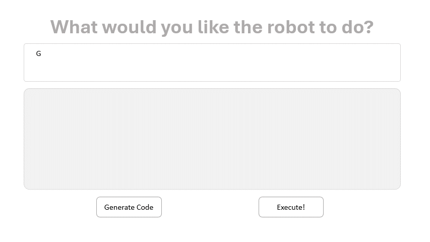

# CodeBotler Overview

[](https://github.com/ut-amrl/robot_commands/actions)



CodeBotler is a system that converts natural language task descriptions into robot-agnostic programs that can be executed by general-purpose service mobile robots.
RoboEval is a benchmark designed for evaluating Large Language Models (LLMs) in the context of code generation for mobile robot service tasks.

This project consists of two key components:
* [CodeBotler](#codebotler-deploy-quick-start-guide): This system features a web interface designed for generating general-purpose service mobile robot programs, along with a ROS (Robot Operating System) Action client for deploying these programs on a robot. It offers the flexibility to explore the code generation capabilities of CodeBotler in two ways: as a standalone system without a robot, as illustrated in the figure above, or by actual deployment on a real robot.


* [RoboEval](#roboeval-benchmark-quick-start-guide): This benchmark for code generation features a suite of 16 user task descriptions, each with 5 paraphrases of the prompt. It includes a symbolic simulator and a temporal trace evaluator, specifically designed to assess Large Language Models (LLMs) in their ability to generate code for service mobile robot tasks.

Project website: https://amrl.cs.utexas.edu/codebotler

## Requirements

We provide a conda environment to run our code. To create and activate the environment:
```shell
conda env create -f environment.yml
conda activate codebotler
```
After installing the conda environment, please go to [pytorch's official website](https://pytorch.org/get-started/locally/) to install the pytorch corresponding to your cuda version (**Note: do not install the cpu version**). 

**Language Model Options**
* To use an OpenAI model, you will need an [OpenAI key](https://platform.openai.com/account/api-keys), either saved in a file named `.openai_api_key`, or in the `OPENAI_API_KEY` environment variable.
* To use a PaLM model, you will need a [Google Generative API key](https://developers.generativeai.google/tutorials/setup), either saved in a file named `.palm_api_key`, or in the `PALM_API_KEY` environment variable.
* You can use any pretrained model compatible with the [HuggingFace AutoModel](https://huggingface.co/transformers/v3.5.1/model_doc/auto.html#automodelforcausallm) interface, including open-source models from the [HuggingFace repository](https://huggingface.co/models) such as [Starcoder](https://huggingface.co/bigcode/starcoder). Note that some models, including Starcoder, require you to agree to the HuggingFace terms of use, and you must be logged in using `huggingface-cli login`.
* You can also use a [HuggingFace Inference Endpoint](https://huggingface.co/docs/inference-endpoints/index).


## CodeBotler Deployment Quick-Start Guide

To run the web interface for CodeBotler-Deploy using the default options (using OpenAI's
`text-daVinci-003` model), run:
```shell
OPENAI_API_KEY=YOURKEY python3 codebotler.py
```
This will start the server on `localhost:8080`. You can then open the interface
by navigating to http://localhost:8080/ in your browser.

List of arguments:
* `--ip`: The IP address to host the server on (default is `localhost`).
* `--port`: The port to host the server on (default is `8080`).
* `--ws-port`: The port to host the websocket server on (default is `8190`).
* `--model-type`: The type of model to use. It is either `openai` for [OpenAI](https://platform.openai.com) (default),
  `palm` for [PaLM](https://developers.generativeai.google/)), or `automodel`
  for
  [AutoModel](https://huggingface.co/transformers/model_doc/auto.html#automodel).
* `--model-name`: The name of the model to use. Recommended options are
  `text-daVinci-003` for OpenAI (default), `models/text-bison-001` for PaLM, and
  `bigcode/starcoder` for AutoModel.
* `--robot`: Flag to indicate if the robot is available (default is `False`).

Instructions for deploying on real robots are included in [robot_interface/README.md](robot_interface/README.md).

## RoboEval Benchmark Quick-Start Guide

The instructions below demonstrate how to run the benchmark using the open-source [StarCoder](https://huggingface.co/bigcode/starcoder) model.

1. Run code generation for the benchmark tasks using the following command:
    ```shell
    python3 roboeval.py --generate --model-type automodel --model-name "bigcode/starcoder" --generate-output starcoder_completions.jsonl
    ```
    This will generate the programs for the benchmark tasks and save them in
    an output file named `starcoder_completions.jsonl`. It assumes default values
    for temperature (0.2), top-p (0.9), and num-completions (20), to generate 20
    programs for each task --- this will suffice for pass@1 evaluation.
2. Evaluate the generated programs using the following command:
    ```shell
    python3 roboeval.py --evaluate --generate-output starcoder_completions.jsonl --evaluate-output starcoder_eval.jsonl
    ```
    This will evaluate the generated programs from the previous step, and save
    all the evaluation results in an output file named `starcoder_eval.jsonl`.


    If you would rather not re-run inference, we have included saved output from every model in the `benchmark/evaluator` directory.
    For example, you can run:

    ```shell
    python3 roboeval.py --evaluate --generate-output benchmark/evaluator/starcoder_completions.jsonl --evaluate-output starcoder_eval.jsonl
    ```
3. Finally, you can compute pass rates for every task:
    ```shell
    python3 pass_k.py starcoder_eval.jsonl
    ```

Detailed instructions for running the benchmark are included in
[benchmark/README.md](benchmark/README.md).
